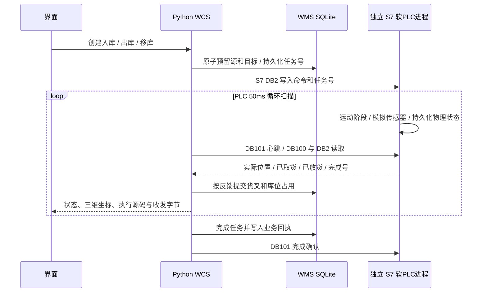

# 本机 PLC 协议仿真与 WCS 调试

这套环境运行一个**独立进程的 Python 软 PLC**，在 `127.0.0.1:1102` 提供真实的 S7 TCP 服务。WCS 使用 `python-snap7==3.1.2` 的客户端，执行真实 `db_write` / `db_read`；运动和传感器进度由 PLC 进程循环扫描产生。PLC 模式下，WCS **不调用 `Engine.tick()` 来推进设备**。

当前执行的是仓库内的 `plc/runtime.py`，**没有执行用户原始 Siemens PLC 程序，也不是 TIA Portal / S7-PLCSIM**。适用于接口、任务生命周期、网络异常、状态恢复、库存事务与三维映射的本机调试；不能据此证明原始 PLC 梯形图、伺服调参或实际安全互锁正确。

## 启动与隔离

项目启动器负责先启动软 PLC，再启动 WCS。也可在两个终端单独启动：

```powershell
.\.venv\Scripts\python.exe -m plc.runtime --host 127.0.0.1 --port 1102 --state data/plc-state.json --trace data/plc-trace.jsonl
.\.venv\Scripts\python.exe -m uvicorn backend.app:app --host 127.0.0.1 --port 8765
```

第二种方式不执行启动器的单实例保护，只用于开发，切勿与项目启动器重复运行。软 PLC 服务和 WCS 适配器均拒绝非回环地址；本次实现不能通过改 IP 接入现场设备。

配置文件为 `config/plc.json`。运行时支持 `--layout`、`--cycle-ms`（默认 50 ms）、`--lease-ms`（默认 2500 ms）。WCS 支持 `WCS_PLC_PORT`、`WCS_PLC_TRACE` 环境变量，启动器还负责 `WCS_PLC_STATE` 对应的 PLC 状态文件。`WCS_PLC_ENABLED=0` 只用于旧的独立引擎测试模式。

不要单独删除运行中的 WCS 数据库或 PLC 快照；二者通过任务号和物理进度恢复。测试使用临时目录及随机回环端口，不会覆盖默认演示数据。

## 调用链



入库/出库/移库对应功能号 2/1/3。WCS 接受的任务有唯一 `request_id`，S7 任务号在持久化快照内递增，范围 1–32767，当前实现不自动回绕。PLC 持久保存已接收任务号，收到同号启动报文不会重新执行。

## SIM_V1 协议

DB2 的字段位置来自提供的交互表。DBW0 状态编码及排/层/列/伸位顺序严格遵循原表。**DBW6 握手语义以及整个 DB100 / DB101 为本次模拟器扩展，未获原厂程序验证。** 站台与实际左右方向映射仍需现场标定；后续真实 PLC 驱动必须核对并替换模拟器扩展。

所有整数和 REAL 均采用 S7 大端字节序；本地演示库位是单深位。

| DB2 地址 | 长度 | 方向 | 含义 |
| --- | --- | --- | --- |
| DBW0 | 2 | PLC → WCS | 原表：8 空闲、9 忙碌、1 出库完成、2 入库完成、3 调仓完成、7 异常；暂停保留忙碌 9，另由 DB100 暂停标志表达 |
| DBW2 | 2 | PLC → WCS | 已完成任务号 |
| DBW4 | 2 | PLC → WCS | 原表报警：注入 X 轴故障=2、软件急停=1。SIM 专用心跳/协议异常不伪造原表报警号，DBW4 为 0，详细原因见 DB100 |
| DBW6 | 2 | PLC → WCS | SIM：最近接收任务号 |
| DBW8/10/12/14 | 各 2 | WCS → PLC | 源排、层、列、伸位；排 1=L、2=R；伸位 1=单深 |
| DBW16/18/20/22 | 各 2 | WCS → PLC | 目标排、层、列、伸位 |
| DBW24 | 2 | WCS → PLC | 站台：入库 1、出库 2、移库 0（SIM） |
| DBW26 | 2 | WCS → PLC | 功能 1 出库、2 入库、3 移库；本版本未实现 4/5/6 独立动作 |
| DBW28 | 2 | WCS → PLC | 1 启动、2 停止、3 软件急停；停止/急停按命令字变化触发 |
| DBW30 | 2 | WCS → PLC | 任务号 1–32767 |

WCS 把 DB2 偏移 8–31 的 24 个字节作为一次写请求发送；PLC 的 DB2 输出区与命令区分开更新。模拟器采用 DB100 一个一致的遥测快照提交库存；DB2 单独读回用于协议观察，避免把不同时刻的两个 DB 误认为原子数据。

| DB100 字节偏移 | 类型 | 含义 |
| --- | --- | --- |
| 0 / 2 | WORD / WORD | 魔数 0x5753 / 版本 1 |
| 4 / 8 / 12 | DWORD | 扫描号 / 启动代数 / 本次运行毫秒 |
| 16 / 20 / 24 | REAL | 实际 x / y / z（m，模拟模型坐标） |
| 28 / 30 | WORD | 阶段编号 / 活动任务号 |
| 32 / 34 | WORD | 货叉载荷布尔值 / 物理进度 0 源位置、1 货叉、2 目标 |
| 36 / 38 / 40 / 42 | WORD | 暂停 / SIM 故障原因 / 速度倍率 / 需恢复确认 |
| 44 / 48 / 52 / 56 | DWORD | 已执行控制序号 / 心跳余量 ms / 扫描进程 PID / 完成次数 |
| 64 / 66 / 68 / 70 | WORD | 状态 / 完成号 / 接单号 / 控制结果码 |

DB100 的 SIM 故障原因与原 DBW4 分开：101 为注入轴故障（DBW4=2）、102 为软件急停（DBW4=1）、901 为心跳超时、902 为旧序号、903 为非法任务。原表另外定义 DBW0=4/5/6/10，本版本未实现对应独立动作与复位任务。

例如 `L-05-02` 写入源地址时为 `DBW8=1, DBW10=2, DBW12=5, DBW14=1`，不会把层与列交换。

阶段顺序：`IDLE → MOVE_SOURCE → PICK → RETRACT_PICK → MOVE_TARGET → PLACE → RETRACT_PLACE → DONE`。只有收到取/放货的传感器进度，WMS 才更新实际载具位置；只有收到相符完成号、进度为 2 且货叉归零，才完成任务并产生业务回执。

| DB101 字节偏移 | 类型 | 含义 |
| --- | --- | --- |
| 0 | DWORD | 控制请求序号；同号不重复执行 |
| 4 / 6 | WORD | 控制动作 / 参数 |
| 8 | DWORD | WCS 心跳计数；变化时更新看门狗 |

控制动作：1 暂停运动、2 核对后恢复、3 单个运动扫描周期、4 注入故障、5 清故障并保持暂停、6 设置 1/2/5/10 倍速、7 确认完成（参数=完成任务号）。控制 0–7 字节在一次 S7 写操作中提交，心跳使用另一个独立写操作。界面操作要等 DB100 的 `control_ack` 真正匹配后才视为已执行。

“暂停”暂停的是**运动执行**；PLC 通信、看门狗、诊断和循环扫描继续。单步只允许在暂停且无故障、无需恢复核对时执行一个运动扫描周期，并不是 TIA 的 CPU STOP / RUN 或指令级断点。

## 通信和恢复

- “断连”关闭 WCS 的 S7 客户端并禁止自动重连。界面冻结最后测量值，任务不会伪完成。PLC 在心跳过期后停止运动、保留载荷与阶段，并报 901。
- “重连”重新建立真实 TCP / S7 会话，读取实际快照。活动任务暂停，必须先清故障（如果存在），再明确恢复。
- PLC 进程重启从 `plc-state.json` 恢复位置、载荷、阶段和任务号；有未完成任务时保持暂停。WCS 重启也先核对已持久化任务与 PLC 反馈，不重新执行取货。
- WCS 先提交完成事务再确认 PLC；确认丢失时只重发确认，不重复库存移动或回执。
- PLC 快照丢失而 WCS 已有取货进度时，禁止自动重放；未知/不匹配的活动任务会保持恢复状态并请求暂停。
- 快照在发布对应物理反馈之前持久化。Windows 临时文件占用导致替换失败时按 10/20/50/100 ms 有界重试；仍失败则停止扫描服务，不发布未持久化结果，WCS 进入通信中断。当前为单机文件快照和 SQLite 的调试实现，不是冗余工业控制平台或断电级持久化保证。

## 实时观察接口

- `GET /api/plc/diagnostics`：连接状态、真实 PLC PID、扫描号、TX/RX 计数、DB2 读回寄存器、最近执行事件与实际 S7 字节。
- `GET /api/plc/source?file=plc/runtime.py`：源码内容和行号。仅允许 `plc/runtime.py`、`plc/protocol.py`、`backend/plc_controller.py` 三个文件，任意文件读取被拒绝。
- `POST /api/plc/control`：`{"action":"pause"}` 等控制；支持 `pause/resume/step/fault/clear_fault/speed/disconnect/reconnect/release_out`。
- 原 `POST /api/simulation/control` 在 PLC 模式下同样调用实际 S7 适配器，保持界面兼容。

执行事件由正在运行的函数写入，包含真实源码文件、函数和调用行号，以及进程加载时的源码 SHA-256。源码接口返回当前文件 SHA-256，界面可发现开发时修改文件但尚未重启导致的行号版本不一致。PLC 扫描示踪每 10 扫描记录一次，任务阶段变化和传感器变化立即记录；WCS 示踪记录真正完成的 S7 读写以及库存提交。它是选择性执行观测，不是逐行调试器，也不是驱动动画的假日志。PLC 扫描事件写入 `data/plc-trace.jsonl`；WCS 的 DB2 命令、DB101 控制、派单、库存提交、完成及连接变化写入同目录的 `wcs-trace.jsonl`。高频心跳和读取仅保留在内存，关键派单证据不会几秒后被心跳挤掉。两类文件均约 2 MB 后保留最近部分记录；诊断接口合并近期流量和关键事件并提供日志路径，若诊断落盘失败会报告 `trace_log_error`。日志有容量上限，UI 历史不是永久审计数据库。

## 自动化验证

```powershell
.\.venv\Scripts\python.exe -m pytest -q
```

`tests/test_plc_integration.py` 会创建真实独立扫描进程，通过回环网络执行 S7 请求，覆盖入库/移库/出库、重复命令、网络断开与看门狗、PLC 重启、WCS 重启、单步与故障、完成确认丢失、PLC 快照丢失后的防重放，以及源码白名单和非回环拒绝。原有 `tests/test_engine.py` 仍用于验证资源预留、库存守恒和旧引擎行为。
